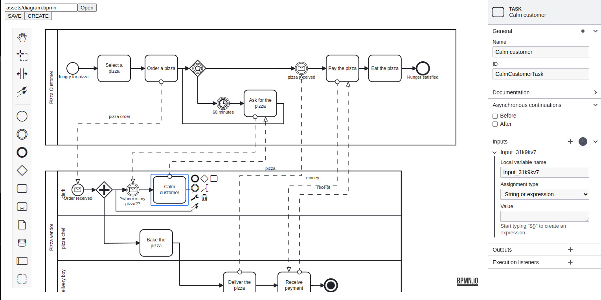

# ❓ bpmn-js integration with reactjs

Embed it as a BPMN 2.0 web modeler into your applications and customize it to suit your needs.

<code>

</code>

### Intall dependecies
``` bash
yarn
```
### Run the project
``` bash
yarn dev
```